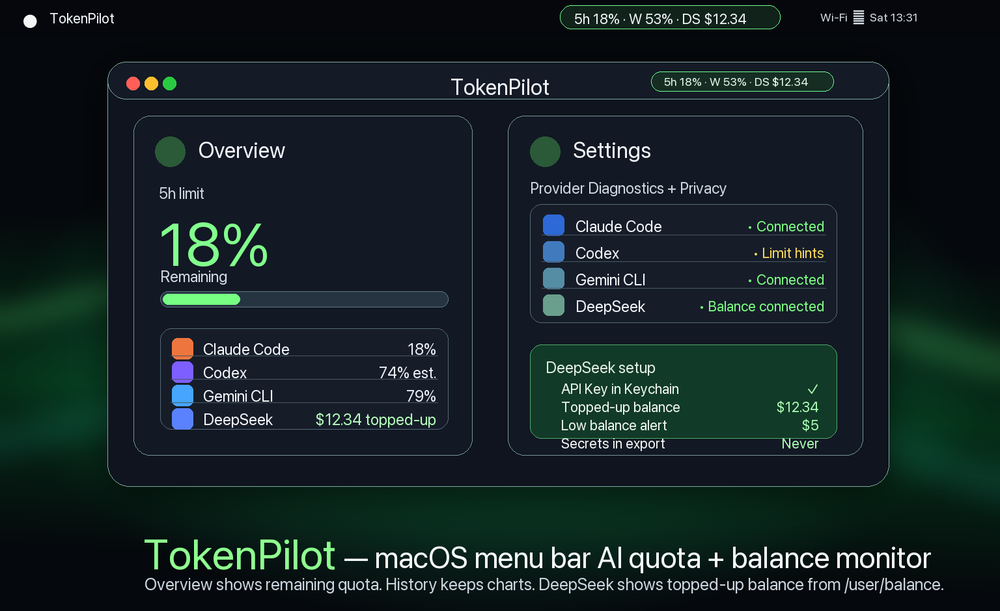

# TokenPilot — macOS メニューバー AI クォータ / 使用量モニター

**TokenPilot** は Claude Code、Codex、Antigravity CLI（従来の Gemini CLI fallback）、DeepSeek balance シグナルを local-first で集約し、macOS メニューバーから残りクォータと使用履歴を確認できるユーティリティです。

> TokenPilot は使用量メタデータ中心で動作します。プロンプト / レスポンス本文、ブラウザ Cookie、provider auth ファイル、任意の Keychain 項目は読みません。
>
> TokenPilot は OpenAI、Anthropic、Google、DeepSeek と提携しておらず、公式認証製品でもありません。



[English](README.md) · [한국어](README.ko.md) · [简体中文](README.zh-CN.md)

---

## 表示するもの

| 画面 | 役割 |
|---|---|
| **Menu bar** | `5h 18% · W 53% · DS $12.34` のように残りクォータと選択した DeepSeek 残高を1行で表示します。 |
| **Overview** | 現在の残りクォータ、provider rows、DeepSeek topped-up balance、今日のトークン、アラート状態を表示します。 |
| **History** | 保存済みの使用イベント、最新 limit signals、折りたたみ式の最近の制限、JSON/CSV export を提供します。 |
| **Settings** | Provider Diagnostics、Codex Limit Hints Connector、DeepSeek balance/API key setup、manual fallback、通知、Telegram/Discord、言語、privacy 境界を設定します。 |

---

## 主な機能

- **macOS メニューバーアプリ**: Dock アイコンなしの `MenuBarExtra` ユーティリティ。
- **残りクォータ優先 UI**: 使用済みではなく「どれだけ残っているか」を優先表示します。
- **Claude / Codex / Antigravity（従来の Gemini fallback）/ DeepSeek 統合**: 各 provider のローカルメタデータと任意の balance シグナルを1つの画面に集約します。
- **DeepSeek balance**: API key を Keychain に保存した場合、公式 `/user/balance` の `topped_up_balance` を native currency で表示します。
- **手動 fallback と stale 表示**: API key がない、または取得に失敗した場合でも値の信頼度を明示します。
- **低残高アラート**: topped-up balance が $5 以下になった場合に通知できます。
- **Privacy-first export**: JSON/CSV export には secret、API key、webhook、chat ID、raw prompt/response、local file path を含めません。

---

## Provider 対応

### Claude Code

- Statusline JSON と local project JSONL fallback。
- 5時間 / 週間 rate limit、context window、token、model、cost metadata を読みます。

### Codex

1. **Codex Limit Hints Connector**: ユーザーが明示的に ON にした場合のみ、local `codex app-server` へ `jsonrpc` フィールドなしの JSONL `initialize`、`initialized`、`account/rateLimits/read` の順で送信します。Codex access token は直接読みません。
2. **Manual Limit Snapshot / `/status` parse**: ユーザー入力値から 5h / weekly を推定します。
3. **Local Activity Beta**: local session JSONL の token_count 系 row を実験的に読みます。

### Antigravity CLI / 従来の Gemini fallback

- 既定では `~/Library/Application Support/TokenPilot/antigravity-statusline.json` の Antigravity `statusLine` bridge output を読みます。
- Settings → Setup Guide → **Connect Antigravity CLI** で bridge をインストールし、Antigravity CLI を再起動して任意の prompt を実行すると JSON が更新されます。
- 保存されるのは model、context-window input/output total、current usage token count、percentage などの allowlist metadata だけです。prompt/response、email、cwd/workspace、provider auth material は保存しません。
- 従来の `~/.gemini` telemetry log と session JSON/JSONL token object は fallback として引き続きサポートします。

### DeepSeek

- Settings で API key を明示的に保存した場合のみ `https://api.deepseek.com/user/balance` を呼びます。
- 表示値は `balance_infos[].topped_up_balance` です。USD 以外の currency も native currency のまま表示します。
- API key は TokenPilot-owned Keychain item に保存され、export されません。
- 接続失敗時は最後に成功した値を stale として表示するか、manual fallback を明示して表示します。

---

## Build / Test

```bash
swift test

make bundle
open build/TokenPilot.app
```

成果物:

```text
build/TokenPilot.app
build/TokenPilot.zip
```
