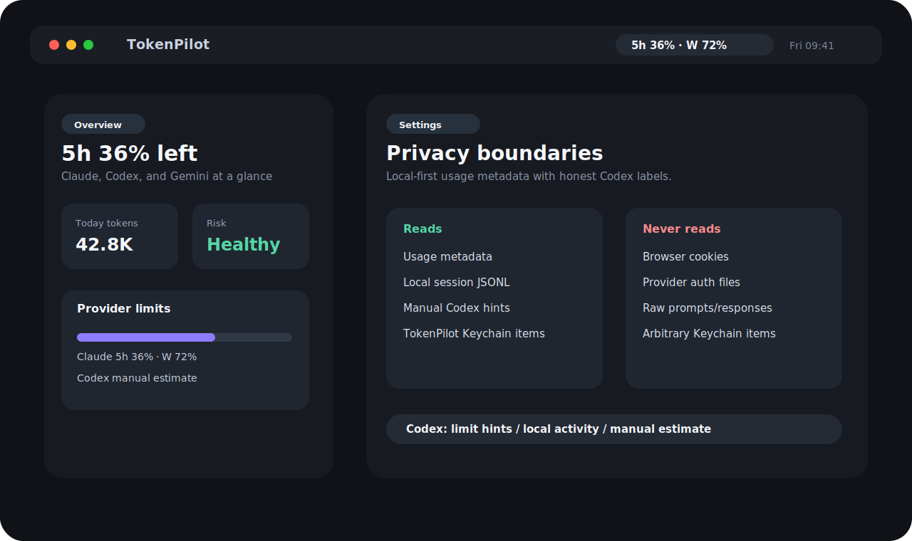

# TokenPilot — macOS 메뉴바 AI 사용량 모니터

**TokenPilot**은 Claude Code, Codex, Gemini CLI의 사용량 메타데이터를 local-first 방식으로 모아 macOS 메뉴바에서 5시간/주간/일일 한도, 오늘 사용량, 위험도를 빠르게 확인하는 유틸리티입니다.

- **상태**: public alpha 준비 중, 로컬 빌드/테스트/앱 bundle 검증 경로 유지
- **앱 표시 이름**: `TokenPilot`
- **Swift Package / 실행 타깃 이름**: `TokenMonitor`
- **앱 번들 산출물**: `build/TokenPilot.app`

> 핵심 원칙: TokenPilot은 사용량 메타데이터 중심으로 동작합니다. 프롬프트/응답 본문, 브라우저 쿠키, 임의 Keychain 항목은 읽지 않습니다. Codex 웹 사용량은 기본 OFF인 opt-in connector로만 분리되어 있습니다.
>
> TokenPilot은 OpenAI, Anthropic, Google과 제휴하거나 공식 인증을 받은 제품이 아닙니다.



---

## 현재 기능 요약

### 1. 메뉴바 / 팝오버 앱

- `MenuBarExtra` 기반 macOS 메뉴바 앱
- Dock 아이콘이 없는 `LSUIElement` 유틸리티 앱
- compact 메뉴바 상태 표시
  - 선택 provider 또는 highest-risk fallback 기준
  - 5시간/주간 남은 비율 예: `5h 64% · W 56%`
  - 메뉴바 label은 앱이 떠 있는 동안 1초 간격의 lightweight tick으로 갱신되고, 실제 데이터 refresh는 5초 간격으로 분리됩니다.
  - warning/critical 상태 표시 및 stale/mock/manual/est. 문맥 표시
  - 데이터 소스가 아직 연결되지 않은 첫 실행에서는 `MOCK` 샘플을 표시할 수 있으며, 실제 사용량처럼 보이지 않도록 상태 라벨을 함께 노출합니다.
- 어두운 premium utility 스타일 팝오버
- 화면 구성
  - **Overview**: 오늘 토큰, 최고 위험도, Best tool, provider 카드, Daily Challenge, 알림 상태
  - **History**: Today / Last 7 days / This month 기간별 집계, 7일 bar chart, provider share, JSON/CSV export
  - **Settings**: Data Sources, Notifications, Telegram, Discord, Language, Setup Guide, Privacy

### 2. Provider 지원

#### Claude Code

- 기본 경로 후보
  - `~/Library/Application Support/TokenPilot/claude-statusline.json`
  - `~/.claude/projects/`
  - `~/.config/claude/projects/`
  - `CLAUDE_CONFIG_DIR/projects`
- 지원 데이터
  - Claude statusline JSON
  - 로컬 JSONL fallback
- 파싱 항목
  - 5시간/주간 rate limit
  - context window usage
  - input/output/cache 토큰
  - model name
  - 비용 메타데이터가 제공되는 경우의 USD 비용

#### Codex

- 기본 경로 후보
  - `CODEX_HOME/sessions` 및 `CODEX_HOME/archived_sessions`
  - 현재 프로세스 `HOME`의 `~/.codex/sessions` / `archived_sessions`
  - Hermes profile HOME처럼 실제 macOS 사용자 홈과 다른 경우의 macOS home fallback
  - 중복 경로는 제거하고 credential 성격 파일은 로컬 로그 탐색 대상에서 제외
- 지원 방식 우선순위
  1. **Codex Limit Hints Connector**: 사용자가 명시적으로 켠 경우 로컬 `codex app-server`를 띄우고 JSON-RPC `initialize` + `account/rateLimits/read`를 호출해 한도 힌트를 조회합니다. TokenPilot은 Codex access token을 직접 읽거나 저장하지 않습니다
  2. **Manual Limit Snapshot**: 사용자가 웹/`/status`에서 본 5h/weekly 값을 직접 입력
  3. **Local Activity Beta**: 로컬 session JSONL의 `token_count` 계열 row를 실험적으로 파싱
- 주의
  - Limit Hints Connector는 Codex CLI app-server의 experimental API에 의존하므로 Codex CLI 변경 시 깨질 수 있습니다.
  - connector는 기본 OFF이며 Codex token 값을 읽기/저장/표시/export/log 하지 않습니다.
  - local JSONL은 ChatGPT/Codex 웹 quota와 1:1 대응되는 공식 지표가 아니므로 `EXPERIMENTAL`, `Local log`, `not web quota`, `est.` 맥락으로만 표시합니다.
  - Codex 비용은 공식 토큰/단가 소스가 안정적으로 제공될 때까지 정확 비용처럼 표시하지 않습니다.

#### Gemini CLI

- 기본 경로 후보
  - `~/.gemini`
  - `~/.gemini/telemetry.log`
  - `~/.gemini/tmp`
  - `~/.gemini/history`
  - `~/.gemini/settings.json`의 telemetry 설정 참고
- 지원 데이터
  - `gemini_cli.api_response` telemetry log
  - session JSON/JSONL token object
- 파싱 항목
  - input/output/cache/reasoning/tool token
  - total token override
  - model, auth type, duration
  - daily request count / cap

### 3. 알림

- macOS local notification
- Telegram alert
- Discord webhook alert
- threshold alert: 80%, 100%, reset
- provider/window별 alert rule + reset cycle deduplication
- Telegram/Discord는 기본 OFF
- Telegram bot token과 Discord webhook URL은 TokenPilot 전용 Keychain item에 저장
- 테스트 메시지 발송 버튼은 사용자가 credential을 직접 저장하고 실행한 경우에만 동작

### 4. History / Export

- daily snapshot 저장 및 refresh 중복 저장 방지
- Today / Last 7 days / This month 기간별 집계
- provider share, 7일 bar chart
- JSON / CSV export
- export payload에는 credential, webhook, chat ID, 로컬 파일 경로, Codex local-log token totals를 포함하지 않도록 설계

### 5. 로컬라이징

현재 코드 기준 언어:

- English
- 한국어
- 日本語
- 简体中文

`TokenPilotLocalizer`와 `Localizable.xcstrings`를 사용합니다.

---

## 프로젝트 구조

```text
TokenPilot/
├── Package.swift
├── project.yml
├── build.sh
├── README.md
├── APP_LAUNCH_GUIDE.md
├── SETTINGS_GUIDE.md
├── SECURITY.md
├── docs/PRIVACY.md
├── Resources/
├── Sources/
│   ├── TokenApp/
│   └── TokenCore/
└── Tests/
```

공개 저장소에는 사용자 설치/실행/기여/보안 보고에 필요한 문서만 남기는 것을 목표로 합니다. 내부 감사 리포트, closeout, 작업 로그, store metadata draft는 public repo 첫인상을 흐릴 수 있어 배포 전 제거 대상입니다.

---

## 로컬 검증 환경

이 프로젝트의 build/test/smoke 명령은 프로젝트 루트에서 `.toolchain/env.sh`를 source한 뒤 실행합니다. 이 스크립트는 install을 수행하지 않고 프로젝트 루트로만 scope합니다.

```bash
cd <project-root>
source .toolchain/env.sh
```

---

## 빌드 / 테스트

### Swift Package 빌드

```bash
source .toolchain/env.sh
swift build
```

### 테스트

```bash
source .toolchain/env.sh
swift test
```

### Xcode 프로젝트 갱신 + 빌드

```bash
source .toolchain/env.sh
xcodegen generate
xcodebuild \
  -project TokenPilot.xcodeproj \
  -scheme TokenPilot \
  -configuration Debug \
  -destination 'platform=macOS' \
  CODE_SIGNING_ALLOWED=NO \
  build
```

### 앱 번들 생성

```bash
source .toolchain/env.sh
make bundle
```

생성 위치:

```text
build/TokenPilot.app
```

실행:

```bash
open build/TokenPilot.app
```

---

## 기술 스택

| 항목 | 현재 값 |
|---|---|
| 언어 | Swift |
| Swift tools | 6.0 |
| Package platform | macOS 13+ |
| Xcode target deployment | macOS 14.0 |
| UI | SwiftUI / AppKit bridge |
| 앱 형태 | macOS menu bar utility |
| 저장소 | UserDefaults + local files + TokenPilot Keychain item |
| 외부 의존성 | 없음 |

---

## 프라이버시 / 보안 경계

TokenPilot이 읽는 것:

- 사용자가 선택한 Claude statusline JSON
- Claude/Codex/Gemini의 로컬 사용량 로그 또는 세션 메타데이터
- Gemini telemetry log
- 사용자가 입력한 Codex status 텍스트 / manual web snapshot
- 사용자가 직접 저장한 Telegram bot token / Discord webhook의 존재 여부
- **Codex Limit Hints Connector를 사용자가 명시적으로 켠 경우에 한해** Codex CLI가 자체적으로 사용하는 계정 인증 상태(읽기/표시/저장하지 않음)

TokenPilot이 읽지 않는 것:

- browser cookies
- 브라우저 세션 저장소
- TokenPilot 외부의 임의 Keychain 항목
- 프롬프트/응답 본문 표시 목적의 transcript 내용
- OAuth refresh token 또는 provider 계정 전체 credential store

TokenPilot이 외부로 보내는 것:

- 기본값: 없음
- Codex Limit Hints Connector가 ON인 경우: 로컬 `codex app-server`에 `account/rateLimits/read` JSON-RPC 요청
- 사용자가 Telegram/Discord를 직접 활성화하고 credential을 저장한 경우: threshold/reset alert 메시지 또는 test message

TokenPilot이 credential에 대해 하지 않는 것:

- token/webhook 값을 UI에 표시하지 않음
- token/webhook 값을 export payload에 넣지 않음
- token/webhook 값을 로그/문서/테스트 결과에 기록하지 않음
- 다른 앱의 Keychain item을 열람하지 않음

---

## 현재 검증 상태

최근 로컬 검증 기준:

```text
swift test                                  PASS — 149 tests
swift build -Xswiftc -warnings-as-errors   PASS
make bundle                                PASS
```

수동/환경 의존 QA:

- 실제 메뉴바 숫자, Overview provider row, Settings privacy 문구는 앱 실행 상태에서 수동 확인합니다.
- 실제 Telegram/Discord 발송, 실제 Codex Limit Hints Connector 네트워크 요청(비공식 한도 힌트)은 사용자 credential/명시 승인 없이는 수행하지 않습니다.

---

## 알려진 제한 / 다음 단계

1. **브라우저 smoke 대상 없음**
   - TokenPilot은 macOS SwiftUI 메뉴바 앱이며 repo에 HTML/JS 웹앱 서버가 없습니다. 브라우저 smoke는 문서/정적 표면 외 앱 기능을 검증하지 못하므로 앱 launch/plist smoke로 대체합니다.

2. **Codex Limit Hints Connector는 opt-in / unofficial**
   - Codex CLI app-server가 제공하는 비공식 한도 힌트를 보기 위한 connector는 기본 OFF입니다.
   - endpoint 변경, 인증 만료, 응답 형식 변경 시 low-confidence 상태로 떨어집니다.

3. **Codex local JSONL은 official quota가 아님**
   - local activity/history/export는 web-comparable totals에서 제외합니다.

4. **Security-scoped bookmark flow는 별도 작업**
   - 앱 sandbox/distribution 단계에서는 파일/folder picker와 bookmark persistence 검증이 필요합니다.

---

## 개발 메모

- 이번 완료 작업은 git/commit/push/deploy 없이 로컬 파일만 갱신합니다.
- API key/token/webhook 값은 문서에 기록하지 않습니다.
- gateway/profile/provider/cron mutation은 수행하지 않습니다.
