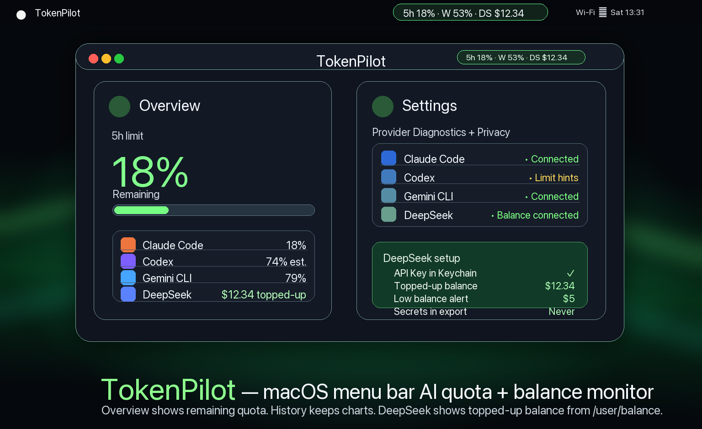

# TokenPilot

[](LICENSE)
[](https://github.com)
[](https://swift.org)
[](#localization)

> **A local-first macOS menu bar monitor that keeps AI capacity visible as simple provider percentages.**
> TokenPilot's signature view is a compact two-row menu metric—provider name above, remaining percentage below. Show selected providers as independent macOS status items or combine them into one item, without opening a dashboard or collecting provider tokens.
>
> TokenPilot is not affiliated with OpenAI, Anthropic, Google, DeepSeek, xAI, opencode, or AWS/Kiro.

**Requires macOS 26 or later.** The app will not launch on earlier versions.

[한국어 README](README.ko.md) · [日本語 README](README.ja.md) · [简体中文 README](README.zh-CN.md)



---

## Why TokenPilot?

AI coding tools expose signals in different places. TokenPilot turns supported quota and local-context signals into glanceable menu bar blocks:

```text
CODEX   GROK
 77%     80%
```

Select exactly which providers appear. Use **Separate items** so macOS can place and reorder each provider independently, or **Combined item** for one compact status item. Percentages mean remaining provider quota where authoritative quota evidence exists; Grok is explicitly remaining local context and is not comparable to provider quota.

---

## Current app surfaces

| Surface | What changed / what it shows |
|---|---|
| **Menu bar** | Signature two-row provider/percentage blocks, with per-provider visibility and separate or combined native status items. |
| **Overview** | Capacity-first current evidence card, provider capacity rows, refresh/recovery notes, and alert status. No local activity analytics cards. |
| **History** | Capacity evidence timeline plus usage event summary and JSON/CSV export. Local activity seven-day/provider-share summaries are export-only compatibility data, not provider quota or visible dashboard surfaces. |
| **Settings** | Provider Diagnostics, Codex limit hints connector, DeepSeek balance/API key setup, local Grok context diagnostics, manual fallback, notifications, Telegram/Discord, language, setup, and privacy boundaries. |

---

## Features

| Feature | Description |
|---------|-------------|
| 🍎 **Glanceable provider percentages** | Native two-row `NSStatusItem` blocks keep each selected provider's remaining percentage visible; show them separately or combined. |
| 📊 **Multi-provider monitoring + setup** | Claude Code, Codex, Antigravity CLI with legacy Gemini telemetry, DeepSeek balance, local Grok context metadata, opencode session tokens/cost, Kiro credits, and Command Code session tokens/cost in one place. |
| 🧮 **Per-model breakdown** | The History screen ranks every model by tokens for the selected period, with request counts and estimated cost where the provider reports it. Included in JSON export under `localActivity.modelBreakdown`. |
| 📈 **7-day trend** | The History screen charts the last seven days of local token activity, highlighting the peak day and counting active days. Inactive days stay visible as zero so gaps are obvious. |
| 📁 **Per-project breakdown** | opencode History ranks workspaces by tokens, requests, and cost for the selected period using only workspace folder names; never included in exports. |
| 🧭 **Remaining-first quota UI** | Limit cards prioritize what is left, not what was consumed. |
| 🔒 **Local-first by default** | Reads local usage metadata; optional connectors and notifications are user-enabled. |
| 🏷️ **Honest confidence labels** | Official, local, manual, estimated, experimental, and limit-hint data are visibly distinct. |
| 🔔 **Alerts** | macOS notifications plus optional Telegram/Discord threshold and reset alerts. |
| 🚀 **Launch at login** | Optional login item starts TokenPilot automatically at log in, so monitoring and alerts keep working after a reboot without opening the app. |
| 💵 **DeepSeek balance** | Optional `/user/balance` integration shows official `topped_up_balance`, native currency, manual fallback, and low-balance alerts. |
| 🧰 **Grok/xAI source** | Local context reads only numeric metadata from `~/.grok/sessions/**/signals.json` (never `auth.json`/tokens/prompts/responses). A separate default-off EXPERIMENTAL/UNOFFICIAL OAuth weekly feature may, after explicit consent, read only the selected access token and expiry from fixed `~/.grok/auth.json` for one billing request; the token stays memory-only and is never logged, stored, diagnosed, or exported. |
| 📈 **History + export** | Capacity evidence history, usage event totals, and JSON/CSV export; local activity seven-day/provider-share summaries are compatibility export fields only. |
| 🖥️ **CLI export + summary** | `TokenPilot export --format json|csv [--capacity]` and `TokenPilot summary` print local usage from the terminal with the same redaction rules as GUI export. |
| ⚡ **Configurable auto-refresh** | Pick the local-source refresh cadence (15 sec to 15 min) from Settings; menu bar tick stays live, and waking the Mac from sleep refreshes right away instead of showing pre-sleep numbers. |
| 📉 **Menu bar trend or bar** | Provider-metrics blocks draw a mini remaining-percent trend from the stored limit history, a filled remaining bar, or nothing — pick one in Settings. |
| 🧵 **Terminal status line** | `TokenPilot statusline` prints one compact line (model, tightest remaining quota with its reset countdown, today's tokens and cost) for a CLI status line, ccusage-style. |
| 📬 **Weekly digest** | Optional opt-in summary of this week's local usage every Monday at 09:00, delivered as a macOS notification while TokenPilot is running. |
| ⌘⇧Space **global shortcut** | Optional opt-in shortcut opens the popover from anywhere; right-click the menu bar item for **Copy summary**. |
| 🌐 **5 languages** | English, 한국어, 日本語, 简体中文, 繁體中文. |
| 📦 **No third-party packages** | Pure Swift / SwiftUI / AppKit bridge. |

---

## Quick Start

### Option 1: Download a Release

Download the latest `TokenPilot.zip` from GitHub Releases, unzip it, then open `TokenPilot.app`.

If macOS Gatekeeper asks for confirmation on an unsigned or ad-hoc signed build, right-click the app and choose **Open**.

### Option 2: Build from Source

```bash
git clone https://github.com/eowlsdh/TokenPilot.git
cd TokenPilot
make bundle
open build/TokenPilot.app
```

### Option 3: Xcode

```bash
git clone https://github.com/eowlsdh/TokenPilot.git
cd TokenPilot
xcodegen generate
open TokenPilot.xcodeproj
# Press Cmd+R
```

### Option 4: Command line

The app binary doubles as a read-only CLI (ccusage/toktrack-style) for local usage:

```bash
# Print today's local usage totals
TokenPilot summary

# Export the last 7 days as JSON to stdout
TokenPilot export --period last7Days

# Export today as CSV to a file
TokenPilot export --format csv --period today --out usage.csv

# Include the latest capacity evidence per series in the JSON payload
TokenPilot export --period today --capacity

# Print one compact line for an editor status line
TokenPilot statusline

# Pick and order the segments, restrict them to one provider, drop the colors
TokenPilot statusline --components capacity,block,burn --provider claude --no-color
```

`statusline` renders `model | quota | today | cost` on a single line for a CLI status line (ccusage `statusline` style). It reads the caller's session JSON from stdin when one is piped in — only the model name and session cost are used — and otherwise renders from stored local usage alone. `--components` picks and orders segments from `model,capacity,today,cost,block,burn,session`, `--provider` restricts the capacity segment and local totals to one provider, `--timezone` decides which day `today` and the 5-hour block belong to, and `--no-color` drops the ANSI colors (`NO_COLOR` does the same). Only fresh provider-reported quota windows are shown as percentages; evidence older than its freshness policy is marked `·S` rather than presented as current, and paths, project labels, and session identifiers are never printed.

To use it with Claude Code, set it as your status line command first, then install the TokenPilot bridge from **Settings → Setup Guide → Connect Claude Code** — the bridge captures Claude's limits and chains to the command that was already configured, so both keep working. **Settings → Setup Guide → Terminal status line** copies the exact command for this build.

`export` accepts `--format json|csv` (default `json`), `--period today|last7Days|thisMonth` (default `last7Days`), `--out <path>`, and `--capacity` (append latest stored capacity evidence). Output never includes prompts, responses, local paths, chat IDs, webhooks, or provider credentials.

---

## How It Works

TokenPilot reads **usage metadata** from local files and explicitly configured sources. It does not read prompts, responses, or browser cookies. Provider auth material is not collected by default; the only exception is the separate default-off EXPERIMENTAL/UNOFFICIAL Grok OAuth weekly feature described below.

| Provider | Data Source | Trust Level |
|----------|-------------|-------------|
| **Claude Code** | Statusline JSON + local project JSONL fallback | High when statusline/rate-limit fields are present. |
| **Codex** | Opt-in Codex CLI limit hints, manual `/status` / manual estimates, local activity JSONL | Medium/estimated/unofficial unless Codex exposes stable official quota metadata. |
| **Antigravity CLI** | TokenPilot statusLine JSON bridge at `~/Library/Application Support/TokenPilot/antigravity-statusline.json`; legacy Gemini `~/.gemini/telemetry.log` remains supported | High for Antigravity statusLine and Gemini telemetry metadata. |
| **DeepSeek** | Optional API-key request to official `/user/balance`, plus manual fallback | High for official balance responses; manual values are clearly labeled. |
| **Grok / xAI** | Numeric local context metadata from `~/.grok/sessions/**/signals.json`; optional default-off EXPERIMENTAL/UNOFFICIAL OAuth weekly usage after explicit consent | Local context shows remaining context (`100 - contextWindowUsage`), not subscription quota. Manual weekly truth has precedence. Experimental OAuth weekly is presentation-only and may break. |
| **opencode** | Read-only local session store: `~/.local/share/opencode/opencode.db` (or `opencode-next.db`), with pre-1.2 `storage/message` JSON as fallback. Honors `XDG_DATA_HOME` | High for token counts and cost: opencode records exact per-message values. Local activity only — opencode publishes no subscription window, so this is never shown as quota. |
| **Kiro** | Read-only local sessions: IDE `usage_summary` credits under `~/.kiro/sessions/<workspace>/sess_*/messages.jsonl`, plus CLI context-window percentage from `~/.kiro/sessions/cli/*.json` | High for the values Kiro itself reports. Kiro meters in **credits**, not tokens, so TokenPilot shows credits as credits and never estimates token counts from transcript text. |
| **Command Code** | Read-only local session transcripts: `~/.commandcode/projects/<project>/<session>.jsonl`. Never reads `~/.commandcode/auth.json` | High for the tokens and cost Command Code records per turn. Command Code meters plans in **dollars over rolling 5-hour and 7-day windows** and publishes those meters only through its own `/usage` view, so TokenPilot shows local spend as activity and never as remaining quota. |

### Provider diagnostics

First-run setup is centered in **Settings → Provider Diagnostics**:

- Each provider shows status, confidence, last checked time, and next action.
- Diagnostics summarize local metadata availability without showing raw paths, prompts, responses, cookies, tokens, or raw events.
- Codex connector state is explicit: off, manual, local activity, or unofficial limit hints.
- DeepSeek balance setup is explicit: no API key, official balance connected, stale balance, or manual fallback.
- Grok/xAI diagnostics report local signal availability and remaining local context. The separate experimental OAuth weekly path is default-off, consent-gated, and does not store credentials or claim official provider quota.
- opencode and Kiro diagnostics report local session store availability. Their databases are opened read-only and immutable, so a running agent is never blocked and its data is never modified. Credential tables (`account`, `credential`, `auth_kv`) are never read.

### Grok / xAI source

TokenPilot's **local context** path reads only numeric metadata from:

```text
~/.grok/sessions/**/signals.json
```

That local-context feature never reads `auth.json`, OAuth tokens, prompts, responses, or provider billing/subscription data. Grok's menu-bar local value is remaining context (`100 - contextWindowUsage`); it is not provider quota and must not be compared with provider quota or API billing.

A **separate** default-off **EXPERIMENTAL / UNOFFICIAL** OAuth weekly feature may, only after explicit consent, read the selected access token and expiry from the fixed path `~/.grok/auth.json`, perform one fixed weekly billing request, keep the token memory-only, and never display, log, store, diagnose, or export it. Manual weekly truth has precedence over experimental OAuth presentation.

### Antigravity CLI setup

The Gemini-facing provider slot now defaults to **Antigravity CLI**:

1. Open **Settings → Setup Guide → Connect Antigravity CLI**.
2. Run the generated bridge script once; it registers Antigravity's `statusLine` command.
3. Restart or re-open Antigravity CLI, run any prompt, then check this file in TokenPilot:

   ```text
   ~/Library/Application Support/TokenPilot/antigravity-statusline.json
   ```

The bridge stores only allowlisted token metadata such as model id/display name, context-window input/output totals, current usage token counts, and percentages. It does **not** store prompt text, response text, email, cwd/workspace path, provider auth material, or arbitrary Keychain data. Existing `~/.gemini/telemetry.log` remains supported as the only legacy Gemini source.

### Menu bar display

The recommended **Provider metrics** layout uses a small two-row block per selected provider:

```text
CODEX   GROK
 77%     80%
```

Choose **Separate items** for independently registered `NSStatusItem`s, or **Combined item** to keep every selected provider in one status item. Detailed, compact, and icon-only layouts remain available for users who prefer window labels, local-activity fallback text, or a minimal icon. **Separate items** applies to those text layouts too: the primary and secondary providers each get their own status item instead of sharing one wide one.

**Menu bar width** caps how much room the text layouts may take — `Full`, `Standard`, or `Narrow`. A narrower setting drops whole components in order of least value first: reset countdowns, then window tags, then the second reading. Nothing is ever cut mid-word or replaced with an ellipsis, so what remains is still a number you can act on.

---

## Screenshot

The current privacy-safe screenshot combines two shipped surfaces from the same local build:

- the real two-row Codex status item in the macOS menu bar;
- Provider metrics settings with Codex and Grok selected as separate items.

The crop excludes the desktop, usernames, local paths, notifications, credentials, and unrelated application content.

---

## GitHub Release positioning

TokenPilot is positioned as a **local-first AI coding usage meter for the macOS menu bar**:

- **No cloud dashboard**: usage stays on-device.
- **No account required**: no TokenPilot account or provider login flow.
- **No provider token collection by default**: Codex/Telegram/Discord/DeepSeek secrets are stored only when explicitly configured, never shown or exported. Grok local context never reads auth material; the separate default-off experimental OAuth weekly feature may transiently use a memory-only access token after explicit consent and never persists it.
- **Honest confidence labels**: official, local, manual, estimated, experimental, and limit-hint sources are visibly distinct.
- **Release artifacts**: `make bundle` produces `build/TokenPilot.app` and `build/TokenPilot.zip`.

Release copy must stay evidence-bound: do not claim notarization, App Store availability, provider account validation, or exact provider billing/quota authority unless those checks were actually performed.

---

## Privacy

TokenPilot is designed as a **local-first** utility:

| ✅ Reads | ❌ Never reads / never keeps |
|----------|------------------------------|
| Claude statusline JSON | Browser cookies |
| Antigravity statusLine JSON bridge / Gemini `telemetry.log` | Raw prompts/responses |
| User-entered Codex values | Exported secrets |
| User-saved DeepSeek API key in TokenPilot Keychain item | Other apps' Keychain items |
| Grok numeric local context metadata from `~/.grok/sessions/**/signals.json` | Grok prompts/responses; local-context path never reads `auth.json` |
| Local session JSONL metadata (where supported) | Persisted Grok OAuth tokens (experimental path is memory-only after consent) |
| TokenPilot-owned notification credentials | Arbitrary provider credential stores outside the fixed, consent-gated Grok OAuth descriptor |

External notifications (Telegram/Discord) are **off by default** and require explicit user configuration. Codex Limit Hints Connector is also off by default and talks to the local Codex CLI app-server rather than reading Codex auth files directly. DeepSeek balance is opt-in and uses a TokenPilot-owned Keychain item for the API key; exports omit secrets. Grok/xAI local context reads only numeric metadata from `~/.grok/sessions/**/signals.json`. The separate default-off EXPERIMENTAL/UNOFFICIAL OAuth weekly feature, after explicit consent only, reads the selected access token and expiry from fixed `~/.grok/auth.json` for one fixed billing request; the token stays in memory and is never logged, stored, diagnosed, or exported. Manual weekly truth has precedence.

See [Privacy](docs/PRIVACY.md) and [Security](SECURITY.md) for details.

---

## Architecture

```text
Sources/
├── TokenApp/                         # AppKit app shell, views, ViewModel
│   ├── TokenMonitorApp.swift          # App entry, NSStatusItem, and NSPopover
│   ├── Views/                         # Overview, History, Settings, components
│   └── Resources/Localizable.xcstrings
└── TokenCore/                         # Business logic, adapters, models
    ├── Models/                        # Provider snapshots, settings, usage models
    ├── Services/
    │   ├── DataSourceAdapters.swift    # Claude/Codex/Antigravity/legacy-Gemini/DeepSeek adapters
    │   ├── AggregationService.swift    # Usage aggregation
    │   ├── MenuBarStatusService.swift  # Menu bar label formatting
    │   ├── UsageHistoryStore.swift     # Historical usage persistence
    │   └── TokenPilotServices.swift    # Notifications, Keychain, export
    └── TokenPilotLocalization.swift
Tests/
├── TokenMonitorTests.swift
└── TokenPilotServicesTests.swift
```

---

## Testing

```bash
swift test

swift build -Xswiftc -warnings-as-errors
# strict build with warnings as errors

make verify
# build + tests + release bundle smoke
```

---

## Localization

| Language | Status |
|----------|--------|
| English | ✅ Full |
| 한국어 | ✅ Full |
| 日本語 | ✅ Fallback supported |
| 简体中文 | ✅ Fallback supported |
| 繁體中文 | ✅ Fallback supported |

---

## Contributing

Contributions are welcome. Please see [CONTRIBUTING.md](CONTRIBUTING.md) and run:

```bash
make verify
```

---

## License

MIT License — see [LICENSE](LICENSE) for details.

---

## Acknowledgments

Built with SwiftUI, AppKit, and a lot of `@MainActor`.  
Inspired by the need to stop guessing AI quota limits.
